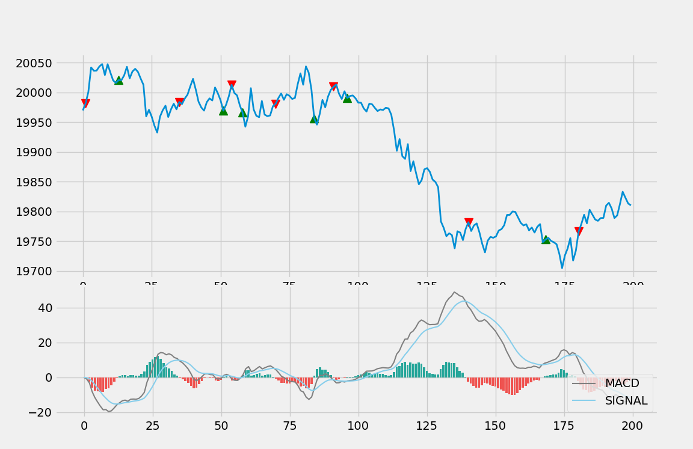

## This project is actively in research and developement 🔭

## About
Binoculars is a trading bot with Binance API. Binoculars 
exposed some strategy algorithms which are utilized for 
both live and back-testing.

## Disclaimer
This repository is for educational purposes only. 
**Use this software at your own risk!**

## TODO
- [x] SMA strategy
- [x] MACD + RSI strategy
- [x] Classification on direction
- [x] DuckDB setup
- [ ] Logging
- [ ] Order Book
- [ ] Testing
- [ ] Microservices (Flask)