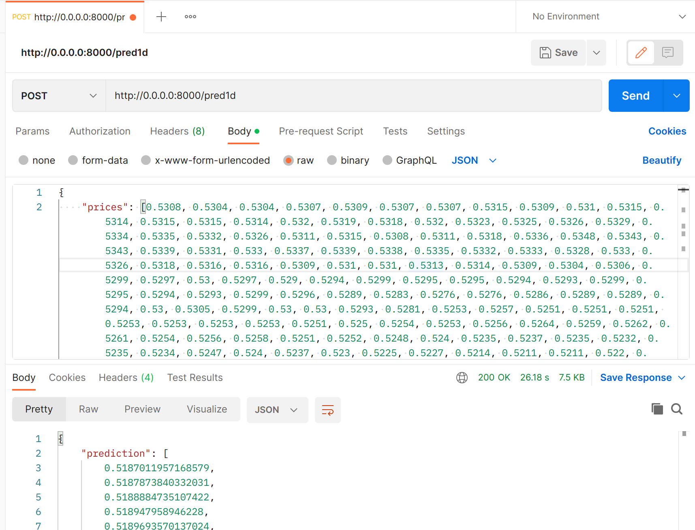

## Docker Usage

```bash
docker build -t <your_container_name>
docker run -d -p 8000:8000 <your_container_name>
```

After that, if it doesn't showed any error message, you can 
now copy the sample JSON input from `sample.json` and 
try running in Insomnia / Postman. The target TCP 
is `http://0.0.0.0:8000/<route_method>`. Note that it might take a few 
seconds to calculate the predicted price.

You can also check whether the container is built with the command `docker ps`. 

To stop container from running forver, type 
`docker stop <container_id>`.

